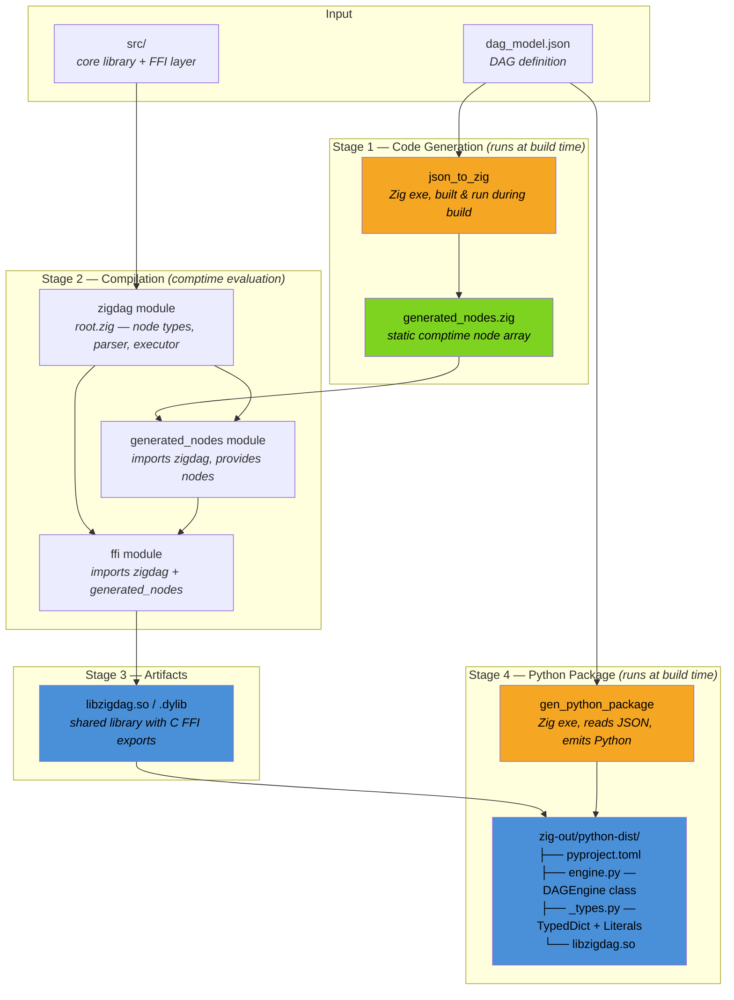
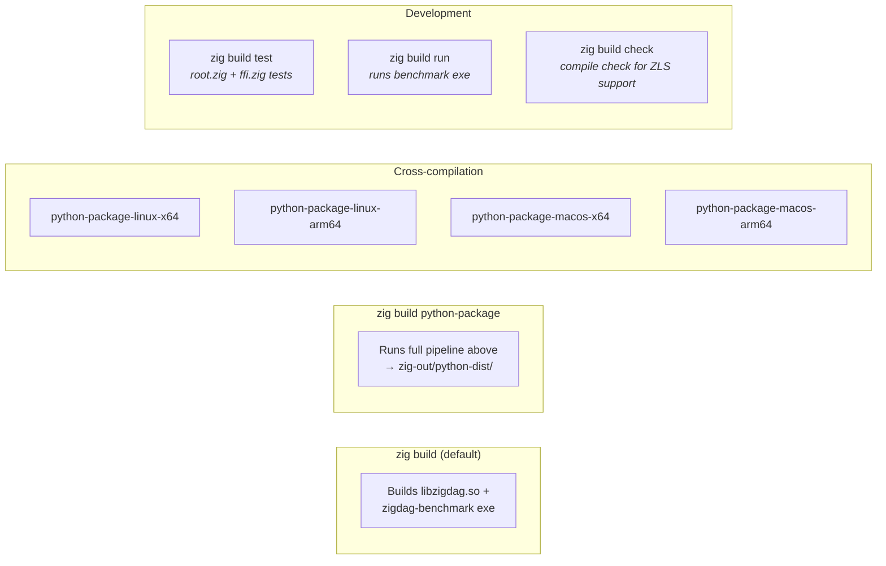

# ZigDag

A compile-time DAG engine that turns JSON-defined calculation graphs into optimized native code via Zig's comptime, with auto-generated Python bindings.

## Why

Teams dealing with multi-step calculations (pricing, scoring, risk models, etc.) often end up with fragile spreadsheet logic, slow Pandas pipelines, or hand-rolled dependency graphs. ZigDag lets you **define your calculation as a DAG**, then compiles it into a native shared library with a fully typed Python package — no Pandas, no runtime interpretation, no overhead.

## How It Works

1. **Define** your calculation graph as a JSON model (or use the visual editor)
2. **Build** — Zig parses the JSON at compile time, topologically sorts the DAG, and generates fully inlined machine code. Zero runtime interpretation.
3. **Use** — import the generated Python package with full type hints and call `engine.calculate()` or `engine.calculate_batch()`

## Build Pipeline

The build involves two Zig programs that run **during the build itself** to generate source code and Python bindings. This is the key "magic" — `build.zig` orchestrates a multi-stage pipeline where executables produce source files that become modules for the next stage.



During **Stage 2**, Zig's comptime kicks in: `comptime_executor.zig` calls `computeExecutionOrder` (Kahn's topological sort) on the generated nodes **at compile time**, then `inline for` unrolls the entire execution into straight-line arithmetic — no loops or dispatch at runtime.

### Build Targets

All targets are invoked via `zig build <target>` from `backend-zigdag/`.



The **`check`** target is what makes ZLS (Zig Language Server) work with the build-generated `generated_nodes` module — it compiles the library, benchmark, and tests without running them, so your editor gets full autocomplete and diagnostics across the generated code.

## Quick Start

```bash
cd backend-zigdag

# Build the Python package (generates .so + typed Python bindings)
zig build python-package

# Install and use
pip install -e zig-out/python-dist
```

```python
from my_dag_model import DAGEngine

engine = DAGEngine()

# Single calculation — fully typed, IDE autocomplete works
result = engine.calculate(nome="tiago", discount=100.0)

# Batch — loop runs in native code, not Python
results = engine.calculate_batch({
    "nome": ["tiago", "ben", "test"],
    "discount": [10.0, 20.0, 5.0],
})
```

The generated `_types.py` provides `TypedDict` definitions with `Literal` constraints, so your editor knows exactly what inputs are valid.

## Project Structure

```
backend-zigdag/           # Source of truth
├── models/               # JSON DAG definitions
│   └── dag_model.json
├── src/
│   ├── core/
│   │   ├── node.zig              # DAGNode type + tagged union operations
│   │   └── comptime_parser.zig   # Topological sort (Kahn's algorithm)
│   ├── executors/
│   │   └── comptime_executor.zig # Generates executor type per model
│   └── ffi.zig                   # C-compatible FFI exports
├── tools/
│   ├── json_to_zig.zig           # JSON → Zig code generator (build step)
│   └── gen_python_package.zig    # Python package generator (build step)
├── benchmark/                    # Performance benchmarks
└── build.zig                     # Build pipeline

frontend-zigdag/          # Visual DAG editor (React + ReactFlow)
└── src/                  # Drag-and-drop node editor, exports JSON
```

## Supported Operations

| Category | Operations |
|----------|-----------|
| **Input** | `dynamic_input_num`, `dynamic_input_str`, `constant_input_num`, `constant_input_str` |
| **Binary** | `add`, `subtract`, `multiply`, `divide`, `power`, `modulo` |
| **Unary** | `negate`, `abs`, `sqrt`, `exp`, `log`, `sin`, `cos` |
| **Aggregation** | `max`, `min`, `weighted_sum`, `clamp` |
| **Control** | `conditional_value_input` (string-to-number mapping) |
| **Output** | `funnel` (marks the final result node) |

## Why It's Fast

- **Compile-time everything**: JSON parsing, DAG validation, topological sorting, and code generation all happen at build time
- **Fully inlined execution**: `inline for` over the execution order means zero loops, zero dynamic dispatch at runtime — just arithmetic instructions
- **Stack-only**: Node values live in a fixed-size array on the stack (~216 bytes for a 9-node model), no heap allocation
- **Batch FFI**: The hot loop runs in native code; Python only pays for one FFI call per batch, not per row

## Frontend

The visual editor (`frontend-zigdag/`) is a React + TypeScript + ReactFlow app for designing DAG models. Drag nodes onto the canvas, connect them, configure operations, and export to JSON. The backend is the source of truth — the frontend is a convenience tool for authoring models.

## Roadmap

- [ ] **Multiple model compilation** — support building and loading several DAG models in a single library
- [ ] **Python codegen from `generated_nodes.zig`** — use the Zig-cached IR in `.zigcache` instead of re-parsing the JSON for Python metaprogramming; the current JSON-based approach makes dot-completion harder than necessary
- [ ] **Comprehensive node tests** — establish thorough test coverage for each operation type and edge cases in the core executor
- [ ] **Intermediate value retrieval** — expose intermediate node outputs through the FFI layer, not just the final funnel result
- [ ] **Expression nodes** — support equation-style expressions (e.g. `(input2) * (input1) + 200`) as a single frontend node to reduce graph clutter
